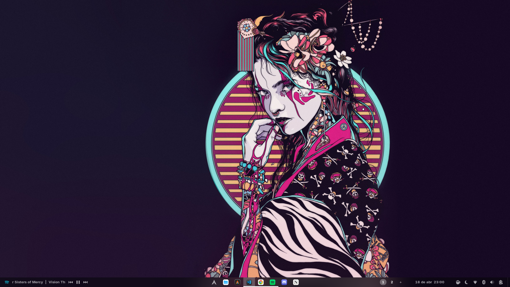
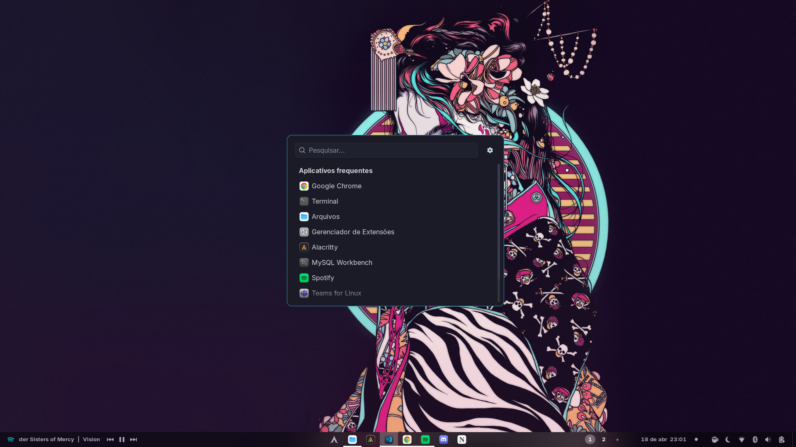
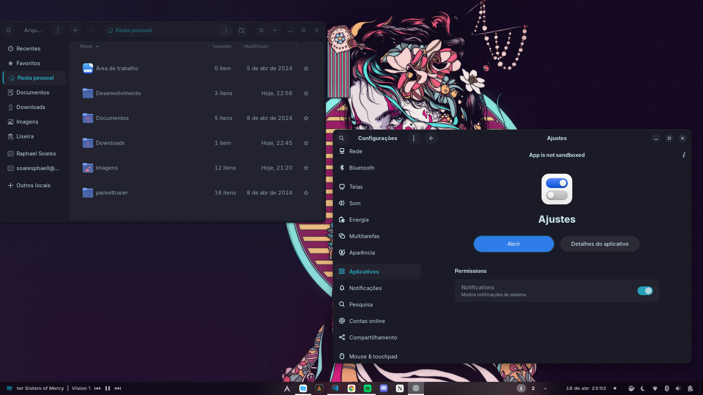
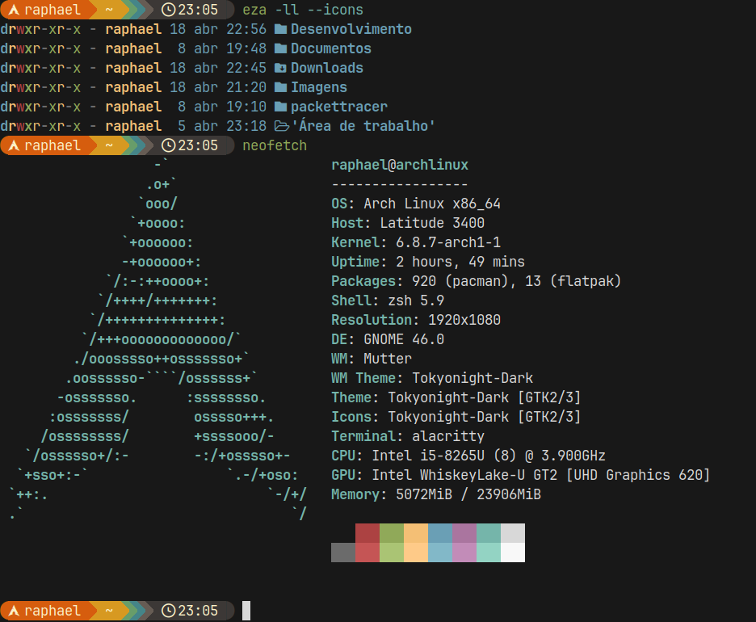

# Raphael's Dotfiles

---

## 1. Dependencies

<details>
  <summary>Click here to expand</summary>

  Install dependencies:
  
  ```bash 
  sudo pacman -S zsh eza stow git curl
  ```
  Then install oh-my-zsh
  ```bash 
  sh -c "$(curl -fsSL https://raw.githubusercontent.com/ohmyzsh/ohmyzsh/master/tools/install.sh)"
  ```
  Then install starship

   ```bash 
    sh -c "$(curl -fsSL https://starship.rs/install.sh)"
  ```

  So you can install the zsh pluguins

  ```bash 
  git clone https://github.com/zsh-users/zsh-autosuggestions.git $ZSH_CUSTOM/plugins/zsh-autosuggestions
  ```

  ```bash 
  git clone https://github.com/zsh-users/zsh-syntax-highlighting.git $ZSH_CUSTOM/plugins/zsh-syntax-highlighting
  ```

  ```bash 
  git clone https://github.com/zdharma-continuum/fast-syntax-highlighting.git ${ZSH_CUSTOM:-$HOME/.oh-my-zsh/custom}/plugins/fast-syntax-highlighting
  ```

  ```bash 
  git clone --depth 1 -- https://github.com/marlonrichert/zsh-autocomplete.git $ZSH_CUSTOM/plugins/zsh-autocomplete
  ```

  

</details>


## 2. Preview
<details>
  <summary>Click here to expand</summary>
  
  
  
  
 
</details>


## 3. Instalation
<details>
  <summary>Click here to expand</summary>
  
  Basically just clone the project and run stow in the stow/ directory and everything will be in place.


```bash
git clone https://github.com/Raphael-Soares/dotfiles.git
cd dotfiles/stow/ 
stow .

```
</details>


